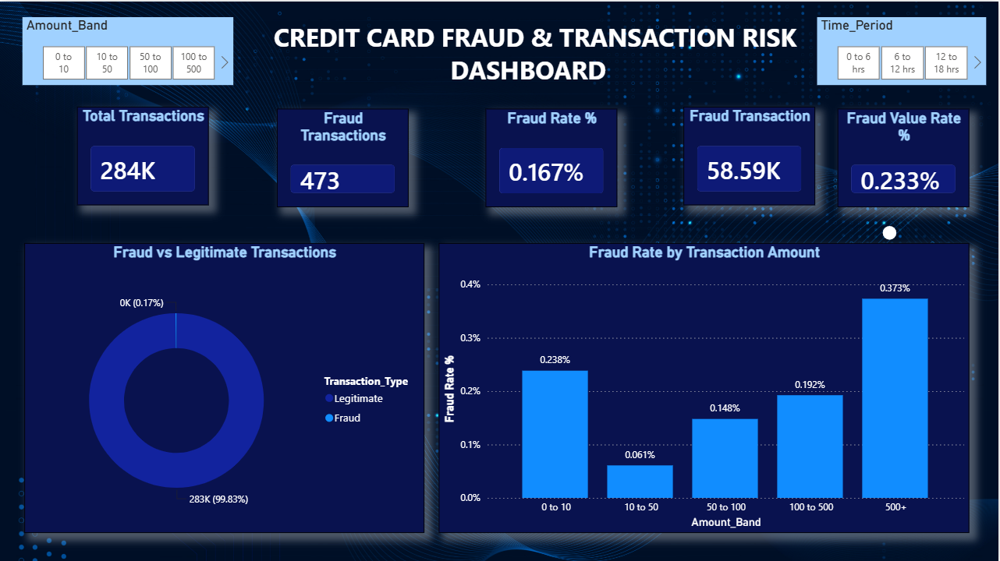

# Credit Card Fraud & Transaction Risk Analysis

**Fraud frequency, financial impact and a risk-monitoring dashboard** | Python • Power BI • DAX


---

## Contents
- [1. About the Project](#1-about-the-project)
- [2. Business Problem & Objectives](#2-business-problem--objectives)
- [3. Dataset](#3-dataset)
- [4. Tools Used](#4-tools-used)
- [5. Analysis Workflow](#5-analysis-workflow)
- [6. KPIs](#6-kpis)
- [7. Key Findings](#7-key-findings)
- [8. Power BI Dashboard](#8-power-bi-dashboard)
- [9. Business Recommendations](#9-business-recommendations)
- [10. Limitations](#10-limitations)
- [11. Project Structure](#11-project-structure)
- [12. How to Reproduce](#12-how-to-reproduce)
- [13. Conclusion](#13-conclusion)

---

## 1. About the Project

A card issuer loses money and customer trust when fraudulent transactions are approved, but fraud is **very rare** (about 1 in 600 transactions here), so it is easy to miss in normal reports.

This project analyses 283,726 credit card transactions to answer three business questions:

1. **How often** does fraud happen? (frequency)
2. **How much money** is involved? (financial impact)
3. **Where** is the risk concentrated? (transaction size and time window)

It is a **descriptive risk-analytics project** (data cleaning, EDA, KPIs, dashboard, recommendations). It is **not** a machine-learning model.


---

## 2. Business Problem & Objectives

| # | Objective | Result |
|---|---|---|
| 1 | Measure fraud frequency and financial impact | Fraud rate **0.167%**; fraud value rate **0.233%** |
| 2 | Compare fraud and legitimate amounts | Median fraud **9.82** vs **22.00**; average fraud **123.87** vs **88.41** |
| 3 | Find where fraud cases and fraud money are concentrated | "0 to 10": 50.3% of cases, 0.8% of value. "500+": 7.2% of cases, 52.4% of value |
| 4 | Check whether fraud rate changes over the data window | 0.076% to 0.520% across 6-hour elapsed periods |
| 5 | Find anonymised features statistically linked to fraud | V17, V14, V12 strongest |
| 6 | Define monitoring KPIs and recommendations | 5 dashboard KPI cards (10 KPIs calculated in Python), 7 recommendations |

**Stakeholders:** Fraud Operations Manager, Head of Risk, Card Product Manager, Senior Management, Risk Analytics team.

---

## 3. Dataset

- **Source:** Credit Card Fraud Detection, ULB Machine Learning Group (Kaggle). European cardholders, September 2013, about 48 hours of transactions.
- **Size:** 284,807 rows × 31 columns, 492 fraud cases (0.172%).
- **After cleaning:** 283,726 rows, **473 fraud** (0.167%). 1,081 exact duplicate rows were removed (19 were fraud).

| Column | Meaning |
|---|---|
| `Time` | Seconds elapsed since the first transaction. **Elapsed time, not clock time.** |
| `V1`–`V28` | Anonymised **PCA-transformed** features. **No business meaning.** |
| `Amount` | Transaction amount (currency not stated) |
| `Class` | 0 = legitimate, 1 = fraud |

**Important limitations**
- V1–V28 are anonymised PCA variables, so the analysis identifies statistical patterns rather than directly interpretable business attributes.
- `Time` is elapsed time, so no claims such as "fraud happens at night" are made.
- Only about 2 days of data and 473 fraud cases; no merchant, customer or location data.

The raw `creditcard.csv` (about 144 MB) is not stored here. Download it from Kaggle (see `Data/README.md`).

---

## 4. Tools Used

- **Python** (Google Colab): Pandas, NumPy, Matplotlib, Seaborn
- **Power BI** and **DAX**: KPI cards, slicers, interactive dashboard

---

## 5. Analysis Workflow

**Python** (`Python/Credit_Card_Fraud_Risk_Analytics.ipynb`)
1. Loaded the data and checked shape, types and statistics.
2. Data-quality check: missing values (0), duplicates (1,081), invalid values (0), zero amounts (kept).
3. Created `Transaction_Type`, `Time_Hours`, `Time_Period` (eight 6-hour **elapsed** bins), `Elapsed_Hour`, `Amount_Band` (0 to 10, 10 to 50, 50 to 100, 100 to 500, 500+).
4. EDA: fraud distribution, amount comparison (median and log scale because amounts are skewed), fraud rate by band and period, fraud concentration, top frauds, V-feature correlation.
5. Calculated 10 KPIs, wrote data-driven insights and recommendations, exported CSVs.

**Power BI** (`PowerBI/`): DAX measures validated against Python (283,726 transactions, 473 fraud, 58,591.39 fraud value).

---

## 6. KPIs

| KPI | Formula | Value |
|---|---|---|
| Total Transactions | count of rows | 283,726 |
| Fraud Transactions | count where Class = 1 | 473 |
| **Fraud Rate %** | Fraud ÷ Total × 100 | **0.167%** |
| Total Transaction Value | sum of Amount | 25,102,001.68 |
| Fraud Transaction Value | sum of Amount where Class = 1 | 58,591.39 |
| **Fraud Value Rate %** | Fraud Value ÷ Total Value × 100 | **0.233%** |
| Average Transaction Amount | Total Value ÷ Total Transactions | 88.47 |
| Average Fraud Amount | Fraud Value ÷ Fraud Transactions | 123.87 |
| Maximum Fraud Amount | max Amount where Class = 1 | 2,125.87 |

**Keep these four separate:** transaction count (how many) · fraud rate (how often) · fraud amount (how much money) · fraud value rate (fraud money as a share of all money).

---

## 7. Key Findings

| # | Finding | Evidence |
|---|---|---|
| 1 | Fraud is rare | 473 of 283,726 = 0.167% (about 1 in 600) |
| 2 | Accuracy is a misleading KPI | "Everything is legitimate" would be 99.83% right and catch 0 frauds |
| 3 | Fraud hurts more by value than by count | Fraud value rate 0.233% vs fraud rate 0.167% |
| 4 | Typical fraud is small; a few large cases lift the average | Median 9.82 vs 22.00; average 123.87 vs 88.41 |
| 5 | Small transactions: many cases, little money | "0 to 10": 50.3% of fraud cases, 0.8% of fraud value |
| 6 | Large transactions: highest rate and most money | "500+": 3.2% of transactions, fraud rate 0.373% (2.2× average), 52.4% of fraud value |
| 7 | Bands above 100 carry most of the loss | 88.3% of fraud value from 26.4% of fraud cases |
| 8 | Fraud rate varies by elapsed period | 0.076% (30 to 36 hrs) to 0.520% (24 to 30 hrs). The two highest-rate periods are also the quietest (about 12,000 vs 35,000 average transactions) |
| 9 | A few large frauds matter | Largest 2,125.87; 34 frauds above 500; top 5 = 14.1% of fraud value |
| 10 | Statistical signals exist | V17 (−0.313), V14 (−0.293), V12 (−0.251). Anonymised, so no business meaning |


## 8. Power BI Dashboard



## 9. Business Recommendations

These are suggestions based on observed patterns. They are **not guaranteed** to reduce fraud and should be piloted or back-tested first.

| # | Recommendation | Based on | Success measure |
|---|---|---|---|
| 1 | Risk-ranked priority queue for transactions above 500 (automated checks first, manual review for the riskiest) | Findings 6, 9 | % of fraud value caught; review time |
| 2 | Step-up authentication for transactions above 100 instead of blocking | Finding 7 | Fraud value rate; customer drop-off |
| 3 | Automated velocity rules for small-value fraud, not manual review | Finding 5 | Fraud count in small bands; alert volume |
| 4 | Monitor fraud rate by time window with thresholds; confirm with real timestamps first | Finding 8 | Rate vs threshold |
| 5 | Test anomaly rules on the real attributes behind the strongest signals | Finding 10 | Share of alerts that are truly fraud |
| 6 | Weekly KPI dashboard: fraud rate, fraud value rate, concentration | Findings 1-3 | Dashboard refreshed on schedule |
| 7 | Capture merchant, location, channel, real timestamp and unique transaction ID | Limitations | Data completeness |

**Business impact (illustrative):** the "500+" band holds 30,682.65 (52.4%) of fraud value, but 99.6% of the 9,109 transactions in that band are genuine (about 1 fraud per 268). So the priority queue must be risk-ranked with step-up checks, not blanket review. See the report for the full scenario.

---

## 10. Project Structure

```text
Credit-Card-Fraud-Risk-Analysis
│
├── Data
│   ├── fraud_cleaned.csv                (283,726 rows, Power BI ready)
│   ├── fraud_kpi_summary.csv
│   ├── fraud_by_amount_band.csv
│   ├── fraud_by_time_period.csv
│   ├── fraud_by_elapsed_hour.csv
│   ├── fraud_by_transaction_type.csv
│   ├── fraud_feature_summary.csv
│   ├── top_fraud_transactions.csv
│   └── README.md                        (how to get the raw Kaggle file)
│
├── Python
│   └── Credit_Card_Fraud_Risk_Analytics.ipynb
│
├── PowerBI
│   ├── Credit_Card_Fraud_Risk_Dashboard.pbix
│   ├── DAX_Measures.md
│   └── README.md
│
├── Documentation
│   ├── Credit_Card_Fraud_Project_Report.docx
│   └── Credit_Card_Fraud_Project_Report.pdf
│
├── Images                               (dashboard screenshots + Python charts)
│
└── README.md
```

## 11. How to Reproduce

1. Download `creditcard.csv` from Kaggle.
2. Open `Python/Credit_Card_Fraud_Risk_Analytics.ipynb` in Google Colab, run all cells and upload the file when asked. A ZIP of the CSV outputs is downloaded.
3. *(Power BI)* Load `fraud_cleaned.csv`, create the measures in `PowerBI/DAX_Measures.md`, and check the cards against the validation table.

---

## 12. Conclusion

This project shows how analytics supports fraud-risk decisions even when fraud is very rare. The key lesson is that **fraud frequency and fraud money tell different stories**: small transactions create most fraud cases, while large transactions hold most of the fraud value. A dashboard built on fraud rate, fraud value rate and concentration gives a risk team a more useful view than total volumes or accuracy.

